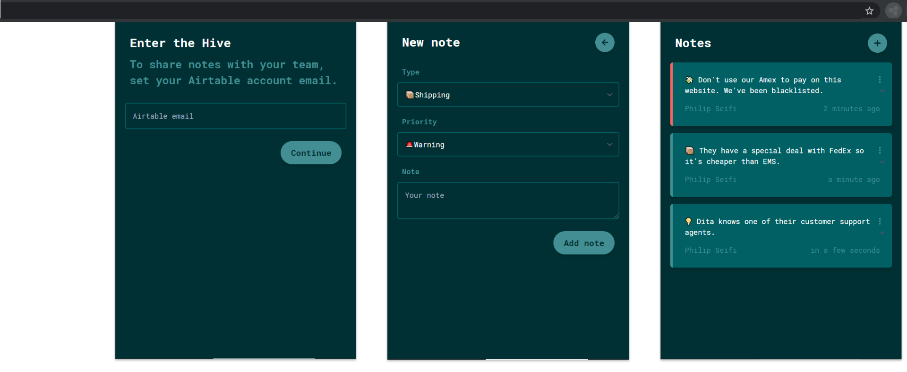
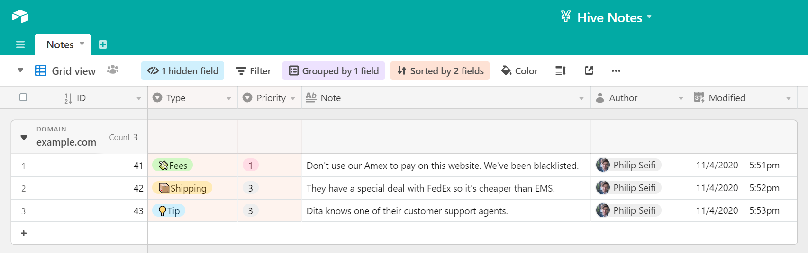

Hive is an internal company browser extension that lets your team attach tips and warnings to any web page.

Notes are stored in your own company Airtable, so you're always in control of your data.

# Screenshots

# Use cases

This extension was originally created for the buying team at [White Rabbit Express](https://www.whiterabbitexpress.com/), but it's invaluable for any group or organization repeatedly interacting with different websites.

# How to use
1. Go to https://airtable.com/shr1dxKNQusW47dRP and click `Copy base` in the top-right corner.
2. Clone this repository, copy the `.env.example` file in the root folder, and rename it to `.env`.
3. [Find your Airtable API and Base ID](https://help.grow.com/hc/en-us/articles/360015095834-Airtable) and update them in the `.env` file. 
4. Run `yarn` and `yarn build` in the root folder. A new zip file will be bundled in the `artifacts` folder.
5. Publish the zip bundle to the [Chrome Web Store as an **Unlisted** extension](https://support.google.com/chrome/a/answer/2714278?hl=en).
6. Invite team members to your Hive Airtable base, and send them your private link to the extension.
