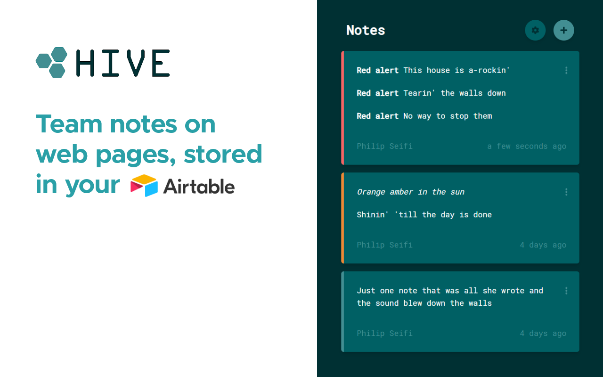

Hive Notes is an internal company browser extension that lets your team attach tips and warnings to any web page.

Notes are stored privately in your own company Airtable, so you're always in full control of your data.

# Screenshots

# Use cases

This extension was originally created for the buying team at [White Rabbit Express](https://www.whiterabbitexpress.com/), but it's invaluable for any group or organization repeatedly interacting with different websites.
