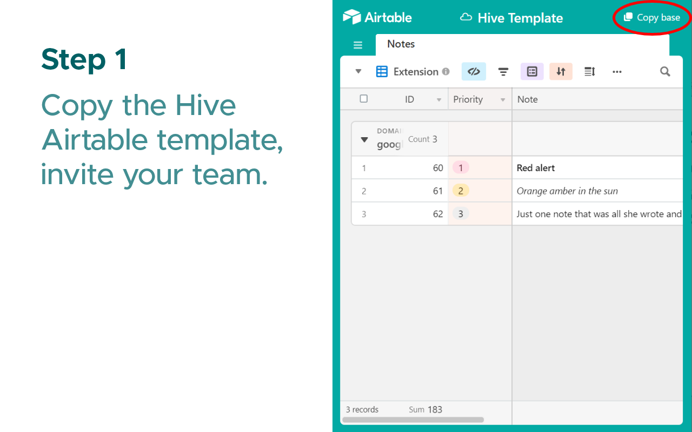

Hive is an internal company browser extension that lets your team attach tips and warnings to any web page.

Notes are stored in your own company Airtable, so you're always in control of your data.

## [Get from Chrome Web Store](https://chrome.google.com/webstore/detail/geonjpedhdlahodmcacapmbgkckaknmm/)

# Screenshots

# Use cases

This extension was originally created for the buying team at [White Rabbit Express](https://www.whiterabbitexpress.com/), but it's invaluable for any group or organization repeatedly interacting with different websites.

# Use Hive with your team
1. Install the extension from https://chrome.google.com/webstore/detail/geonjpedhdlahodmcacapmbgkckaknmm/
2. Go to https://airtable.com/shr1dxKNQusW47dRP and click `Copy base` in the top-right corner.
3. Set your Airtable API Key and Base ID in the extension.
4. Invite team members to your Hive Airtable base, and set up their extensions with the same Base ID.

Note: Instead of step (1), you can also publish the zip in the [artifacts](artifacts) folder to the [Chrome Web Store as an **Unlisted** extension](https://support.google.com/chrome/a/answer/2714278?hl=en).

# Changelog
### 0.7
- Options tab with detailed onboarding instructions.

### 0.6
- Added a Settings page where users can change their Airtable email, API Key and Base ID.

### 0.5
- Hive now asks for your Airtable API Key and Base ID during onboarding if they're not set in the .env file.

### 0.4
- Added Markdown support

### 0.3
- The icon now changes colours based on notes attached to the current page. Gray if there are no notes yet, teal if there are notes attached, and red if there's at least one note with a Warning (1) Priority.

  

### 0.2.0
- You can now add, delete and edit notes from within the extension, rather than through an Airtable form.
